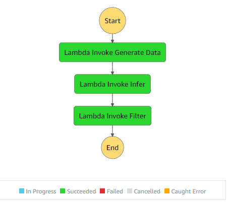

Lambda functions to form a serverless workflow. The lambda functions can be interface between the users and deployed instances, they can also perform tasks such as data transformation and filtering. 

In this small project, we define three lambda functions:
- data transformation 
- getting inference from the deployed endpoint 
- filtering based on the model confidence.

Then we create a step function to orchestrate the workflow. The output of each lambda function can be defined as the input of the next. Although not used here, step function state machine can also help deciding on what task should be done next based on the previous results. The step function is created using the graphical user interface and the JSON output of that is also shown.

Then a demo of visualization from the DataCapture Monitor is shown.
