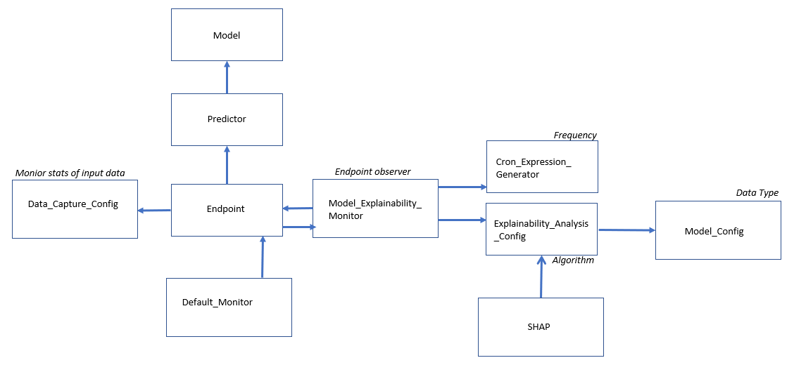

# Examples of using AWS Sagemaker for ML applications

## AutoGluon

[AutoGluon](https://auto.gluon.ai/stable/index.html) is an open-source AutoML framework from AWS that requires only a single line of Python to train highly accurate machine learning models on an unprocessed tabular dataset such as a CSV file. [Paper](https://arxiv.org/abs/2003.06505) [AWS blog](https://aws.amazon.com/blogs/opensource/machine-learning-with-autogluon-an-open-source-automl-library/)
It has the capability of using many different models and automatically stack and create and ensemble model from them. It could be a solution to many problems or at least the first step if the models make sense for the data for the problem. Good feature engineering before using the model could be critical.

Dataset: [Bike Sharing Demand](https://www.kaggle.com/c/bike-sharing-demand)

This is a quick test of AutoGluon on Sagemake and did not spent too much time on feature selection and cleaning.

## Endpoints and Model Deployment on AWS Sagemaker

A simple example on:
- Preprocessing and resaving data on S3 (Sagemaker needs data on AWS S3)
- Setting up a training job from AWS available frameworks in a notebook
- Deploying the trained model and creating an endpoint instance for inference model (model in production)
- Sending inputs to the endpoint. Killing the endpoint if it is not used.

Data: [E-commerce's reviews](https://www.kaggle.com/code/u601372/e-commerce-s-review/data)

## Model Monitoring

We need to monitor model performance after deployment for several reasons. For example:
- To check if the model performance is decreasing and a re-training job should be initiated.
- To check if the distribution of the input data going to the model is changing.
- To learn more about the statistics and performance of the data as well as inferences.
- Also we may need to explain why the model makes a prediction.

This is possible by using AWS Sagemake monitoring capabilities such as Clarify, Default Model Monitor, and Data Capture Config.

The design pattern used for creating objects and instances for monitoring is a bit complicated. The figure below gives a simplified visualization that can help understand the flow and be able to create and set the parameters for each object in correct order.

