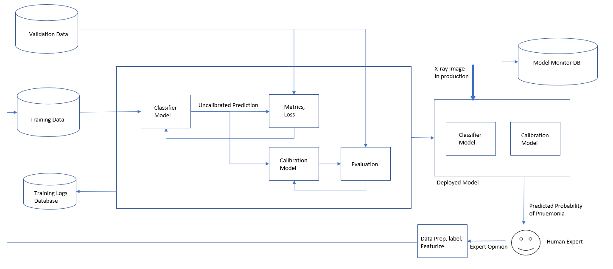

# Examples of using AWS Sagemaker for ML applications

## AutoGluon

[AutoGluon](https://auto.gluon.ai/stable/index.html) is an open-source AutoML framework from AWS that requires only a single line of Python to train highly accurate machine learning models on an unprocessed tabular dataset such as a CSV file. [Paper](https://arxiv.org/abs/2003.06505) [AWS blog](https://aws.amazon.com/blogs/opensource/machine-learning-with-autogluon-an-open-source-automl-library/)
It has the capability of using many different models and automatically stack and create and ensemble model from them. It could be a solution to many problems or at least the first step if the models make sense for the data for the problem. Good feature engineering before using the model could be critical.

Dataset: [Bike Sharing Demand](https://www.kaggle.com/c/bike-sharing-demand)

This is a quick test of AutoGluon on Sagemake and did not spent too much time on feature selection and cleaning.

## Endpoints and Model Deployment on AWS Sagemaker

A simple example on:
- Preprocessing and resaving data on S3 (Sagemaker needs data on AWS S3)
- Setting up a training job from AWS available frameworks in a notebook
- Deploying the trained model and creating an endpoint instance for inference model (model in production)
- Sending inputs to the endpoint. Killing the endpoint if it is not used.

Data: [E-commerce's reviews](https://www.kaggle.com/code/u601372/e-commerce-s-review/data)

## Model Monitoring

We need to monitor model performance after deployment for several reasons. For example:
- To check if the model performance is decreasing and a re-training job should be initiated.
- To check if the distribution of the input data going to the model is changing.
- To learn more about the statistics and performance of the data as well as the inferences.
- Also we may need to explain why the model makes a prediction.

This is possible by using AWS Sagemake monitoring capabilities such as Clarify, Default Model Monitor, and Data Capture Config.

The design pattern used for creating objects and instances for monitoring is a bit complicated. The figure below gives a simplified visualization that can help understand the flow and be able to create and set the parameters for each object in correct order.

[Wine Dataset](https://scikit-learn.org/stable/modules/generated/sklearn.datasets.load_wine.html) that is used in an earlier notebook to demo the XGBoot feature importance, is used to train and deploy a XGBoost endpoint. Then a Clarify endpoint using SHAP algorithm is deployed. The notebook has more explanation on to initialize and set the monitors.

## Creating a workflow in AWS Sagemaker

Lambda functions can be used to form a serverless workflow. The lambda functions can be interface between the users and deployed instances, they can also perform tasks such as data transformation and filtering. In this small project, we define three lambda functions for 1- data transformation 2- getting inference from the deployed endpoint 3- filtering based on the model confidence.

Then we create a step function to orchestrate the workflow. The output of each lambda function can be defined as the input of the next. Although not used here, step function state machine can also help deciding on what task should be done next based on the previous results. The step function is created using the graphical user interface and the JSON output of that is also shown.

Then a demo of visualization from the DataCapture Monitor is shown.

## Script mode training with hp-tuning, debugging, and profiling

This project illustrates the following:

- How to use script mode for training
- How to do hyper-parameter tuning in script mode
- How to use sagemaker debugger and profiler and output the data
- How to package code in a customized docker container

Useful links:
- [Intro to MLOps](https://medium.com/illumination/introduction-to-mlops-f877ccf10db1)
- [Intro to Sagemaker](https://medium.com/swlh/a-gentle-introduction-to-aws-sagemaker-ml-ai-on-the-cloud-de8dd0191818)
- [More info on Sagemaker](https://medium.com/@rafalb/machine-learning-with-aws-sagemaker-part-1-571d57a757e3)

Reference: [Extend a prebuilt container](https://docs.aws.amazon.com/sagemaker/latest/dg/prebuilt-containers-extend.html)

## Diagnosis of Pneumonia from X-ray images

End-to-End flow for an ML system for detection of Pneumonia from X-ray images is implemeted and illustrated on AWS.

Most works on medical imaging classifiers ignore the fact that for a diagnosis a probability of detection is crucial. In this project a probability calibration model is trained, applied, and deployed to the output of an image classifier.

